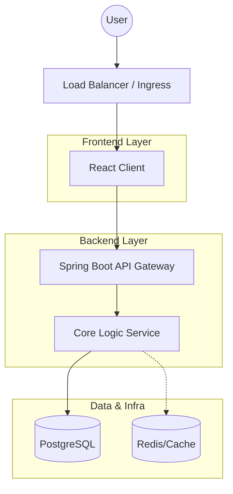

# EfficienCity RMS

<div align="center">

**A centralized platform for municipal resource management and inter‑municipality collaboration.**

[](https://github.com/AngelosFikias0/Resource_Management_System/stargazers)
[](https://github.com/AngelosFikias0/Resource_Management_System/network/members)
[](https://github.com/AngelosFikias0/Resource_Management_System/issues)
[](LICENSE)

[Overview](#-overview) • [Features](#-features) • [Architecture](#-architecture) • [Tech Stack](#-tech-stack) • [Getting Started](#-getting-started) • [Team](#-team)

</div>

---

## 📖 Overview

**EfficienCity RMS** is a full‑stack ecosystem designed to modernize how municipalities register, allocate, share, and audit public resources. By replacing fragmented, manual processes with a single source of truth, the platform improves asset utilization, reduces operational costs, and fosters transparency between local authorities and citizens.

### Core Outcomes
* 👁️ **Real-time Visibility:** Instant tracking of municipal assets and availability.
* 🤝 **Collaboration:** Seamless inter‑municipality resource sharing.
* 🛡️ **Accountability:** Immutable audit trails for every transaction.
* 📊 **Intelligence:** Data-driven decision-making via utilization analytics.

---

## 🧩 The Challenge vs. The Solution

| The Problem | The EfficienCity Solution |
| :--- | :--- |
| **Fragmented Tools:** Disconnected spreadsheets and manual workflows. | **Centralized Registry:** A unified digital inventory for all assets. |
| **Slow Procurement:** Lengthy approval cycles and idle resources. | **Automated Workflows:** Structured requests with instant status updates. |
| **Opacity:** Limited accountability and public trust. | **Transparency Portal:** Public dashboards and verifiable transaction history. |
| **Silos:** Minimal cross‑municipality cooperation. | **Federated Sharing:** A network layer allowing municipalities to support one another. |

---

## ⚡ Features

### 🏛️ For Municipal Authorities
* **Lifecycle Tracking:** Full CRUD operations for resource registration.
* **Inter-Municipality Requests:** Borrow or lend resources seamlessly between districts.
* **Approval Workflows:** Role-based logic for reviewing and approving allocations.
* **Analytics:** KPI dashboards for demand forecasting and usage reports.

### 👤 For Citizens
* **Open Data Dashboard:** View aggregated data on public spending and resource usage.
* **Transparency:** Verify transaction histories to ensure fair usage.
* **Accessibility:** Mobile-friendly interface for on-the-go access.

### 🛠️ For Administrators
* **RBAC:** Granular User and Role management.
* **Observability:** System health monitoring via Prometheus/Grafana.
* **Security:** Automated backup and recovery protocols.

---

## 🏗️ Architecture

The system follows a modular, cloud-native design principle, ensuring horizontal scalability and clear separation of concerns.



---

## 💻 Tech Stack

### Frontend


### Backend


### Data & Infrastructure


### DevOps & Monitoring


---

## 🚀 Getting Started

### Prerequisites

* **Node.js:** v18+
* **Java:** JDK 17+
* **Docker:** v20+
* **PostgreSQL:** v14+

### 🔧 Installation

1. **Clone the repository**
```bash
git clone https://github.com/AngelosFikias0/Resource_Management_System.git
cd Resource_Management_System
```

2. **Environment Setup**

Create a `.env` file in the root directory:
```env
DB_HOST=localhost
DB_PORT=5432
DB_NAME=efficien_city_rms
DB_USER=your_username
DB_PASSWORD=your_password
JWT_SECRET=your_super_secret_key_change_me
JWT_EXPIRATION=86400
```

3. **Run via Docker (Recommended)**
```bash
docker-compose up -d --build
```

4. **Manual Execution**

*Backend:*
```bash
cd backend
./mvnw clean install
./mvnw spring-boot:run
```

*Frontend:*
```bash
cd frontend
npm install
npm start
```

Access the application at `http://localhost:3000`.

---

## 👥 Team

Academic supervision provided by the **University of Macedonia**.

| Name | Role | Socials |
| --- | --- | --- |
| **Άγγελος Φίκιας** | Software Architect | [](https://github.com/AngelosFikias0) |
| **Αλέξανδρος Λαζαρίδης** | Design Lead | [](#) |
| **Βάιος Παλιούρας** | Project Manager | [](#) |
| **Ιωάννης Τσιρκινίδης** | Tech Research Lead | [](#) |

---

## 🤝 Contributing

Contributions are what make the open-source community such an amazing place to learn, inspire, and create.

1. Fork the Project
2. Create your Feature Branch (`git checkout -b feature/AmazingFeature`)
3. Commit your Changes (`git commit -m 'Add some AmazingFeature'`)
4. Push to the Branch (`git push origin feature/AmazingFeature`)
5. Open a Pull Request

---

## 📄 License

Distributed under the MIT License. See `LICENSE` for more information.

---

## 📧 Contact

Project Link: [https://github.com/AngelosFikias0/Resource_Management_System](https://github.com/AngelosFikias0/Resource_Management_System)

---

<div align="center">

Made with ❤️ by the EfficienCity Team

</div>
